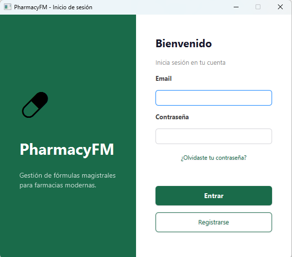
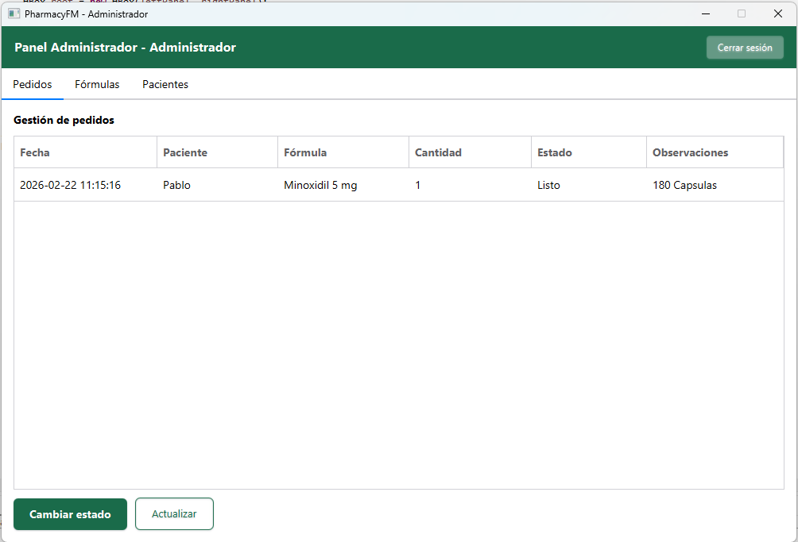
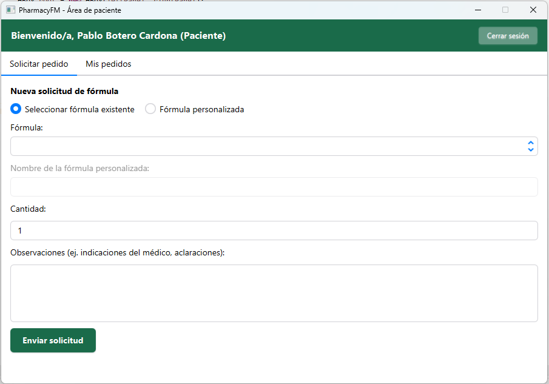

# PharmacyFM

Proyecto de fin de grado DAM — app de escritorio para farmacias. 
La idea surgió de un vacío real detectado tras años de experiencia en el sector de la salud: las farmacias no disponen de una herramienta sencilla para gestionar 
fórmulas magistrales, controlar la trazabilidad de los pedidos y mantener el contacto con sus pacientes desde una misma aplicación.


---

## Capturas de pantalla

### Inicio de sesión


### Panel de administrador


### Panel de paciente


---

## Funcionalidades

### Rol Paciente
- Registro con aceptación de política de privacidad (RGPD)
- Solicitud de fórmulas del catálogo o personalizadas
- Selección de cantidad y unidad (Cápsulas, Gramos, Mililitros, Comprimidos)
- Consulta del historial de pedidos y su estado en tiempo real
- Recuperación de contraseña desde la pantalla de login

### Rol Administrador
- Gestión completa del catálogo de fórmulas magistrales
- Seguimiento de pedidos con cambio de estado
- Gestión de datos de pacientes

---

## Tecnologías

| Tecnología | Uso |
|---|---|
| Java 23 | Lenguaje principal |
| JavaFX 23 | Interfaz gráfica |
| AtlantaFX | Tema visual moderno (CupertinoLight) |
| SQLite | Base de datos local |
| BCrypt | Hash seguro de contraseñas |
| Maven | Gestión de dependencias |

---

## Arquitectura

El proyecto sigue una arquitectura en tres capas que separa responsabilidades:

```
UI (LoginScreen, AdminWindow, UserWindow)
        ↓
Servicios (AuthService, PedidoService, FormulaService)
        ↓
Repositorios (UsuarioRepository, PacienteRepository, FormulaRepository, PedidoRepository)
        ↓
Base de datos (DatabaseConnection → SQLite)
```

Principios aplicados: **Responsabilidad única (SOLID)**, **DRY**, **patrón DAO/Repository**.

---

## Instalación y ejecución

### Requisitos
- Java 23+
- Maven 3.x

### Pasos

```bash
# 1. Clona el repositorio
git clone https://github.com/TU_USUARIO/pharmacyfm.git

# 2. Entra en el directorio
cd pharmacyfm

# 3. Ejecuta con Maven
mvn javafx:run
```

La base de datos se crea automáticamente en el primer arranque.

**Credenciales por defecto:**
- Email: `admin` | Contraseña: `admin`

---

## Estructura del proyecto

```
Pharmacy_FM/
├── src/
│   ├── app/
│   │   ├── repository/       # Capa de acceso a datos
│   │   ├── service/          # Lógica de negocio
│   │   ├── Database.java     # Inicialización de BD
│   │   ├── DatabaseConnection.java
│   │   └── *.java            # Modelos y ventanas
│   └── resource/
│       └── styles.css        # Estilos personalizados
├── docs/
│   └── screenshots/
└── pom.xml
```

---

## Seguridad

Las contraseñas se almacenan con **BCrypt** (factor de coste 10), lo que las hace resistentes a ataques de fuerza bruta. Nunca se guardan en texto plano.

---

## Mejoras futuras

- Envío de email real al recuperar contraseña (ahora se cambia desde la app)
- Exportar el historial de pedidos a PDF
- Añadir tests unitarios con JUnit
- Quizás migrar el backend a Spring Boot en el futuro

---

## Autor

**Pablo Botero Cardona** — Técnico Superior en DAM  
[LinkedIn](https://www.linkedin.com/in/pablo-botero-cardona/) - [GitHub](https://github.com/PabloBoteroCardona)
