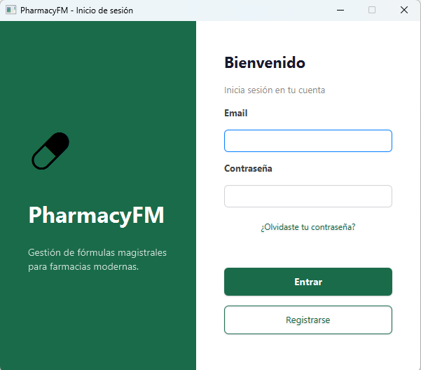
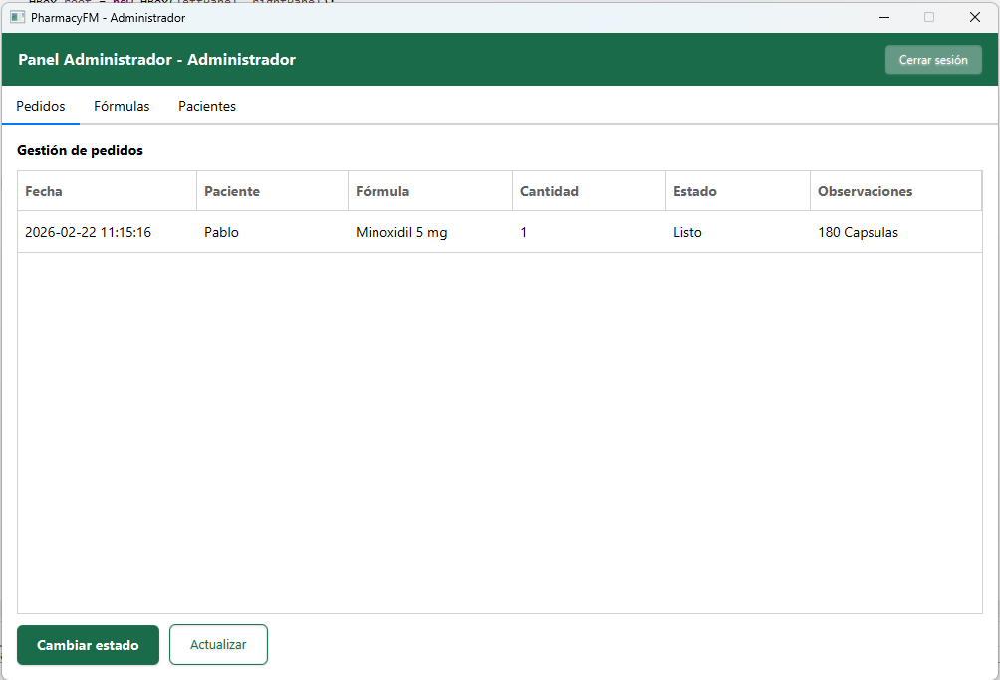
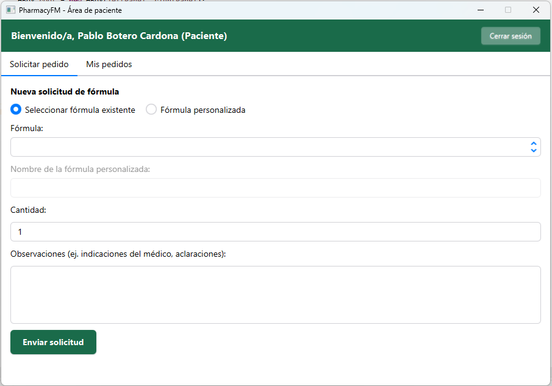

# PharmacyFM

Aplicación de escritorio para la gestión de fórmulas magistrales en farmacias.  
La idea surgió de un vacío real detectado tras años de experiencia en el sector de la salud: las farmacias no disponen de una herramienta sencilla para gestionar fórmulas magistrales, controlar la trazabilidad de los pedidos y mantener el contacto con sus pacientes desde una misma aplicación.

El proyecto se desarrolló en dos etapas: una primera versión funcional como trabajo de fin de grado DAM, y una posterior **refactorización completa hacia Clean Architecture** con el objetivo de servir como demostración de diseño de software para portfolio.


---

## Capturas de pantalla

### Inicio de sesión


### Panel de administrador


### Panel de paciente


---

## Funcionalidades

### Rol Paciente
- Registro con aceptación de política de privacidad (RGPD)
- Solicitud de fórmulas del catálogo o personalizadas
- Selección de cantidad y unidad (Cápsulas, Gramos, Mililitros, Comprimidos)
- Consulta del historial de pedidos y su estado en tiempo real
- Recuperación de contraseña desde la pantalla de login

### Rol Administrador
- Gestión completa del catálogo de fórmulas magistrales (CRUD)
- Seguimiento de todos los pedidos con cambio de estado
- Gestión de datos de contacto de pacientes

---

## Tecnologías

| Tecnología | Versión | Uso |
|---|---|---|
| Java | 23 | Lenguaje principal |
| JavaFX | 23 | Interfaz gráfica de escritorio |
| AtlantaFX | 2.1.0 | Tema visual moderno (CupertinoLight) |
| SQLite | 3.45 | Base de datos local embebida |
| BCrypt | 0.4 | Hash seguro de contraseñas |
| SLF4J + Logback | 2.0 / 1.5 | Logging estructurado |
| JUnit 5 | 5.11 | Tests unitarios e integración |
| Mockito | 5.12 | Mocks para tests unitarios de servicios |
| Spring Boot | 3.3.4 | API REST (mismo dominio que la UI JavaFX) |
| SpringDoc / Swagger UI | 2.6 | Documentación interactiva de la API |
| JaCoCo | 0.8.12 | Cobertura de código (umbral ≥ 70 %) |
| Maven | 3.x | Gestión de dependencias y ciclo de vida |

---

## Arquitectura

El proyecto sigue **Clean Architecture** con regla de dependencia estricta.  
Las capas internas no conocen las externas: el dominio y los servicios son independientes de JavaFX, SQLite o cualquier otro framework.

```
┌─────────────────────────────────────────────┐
│  UI  (app.ui.panels.*, AdminWindow…)        │  JavaFX — solo consume servicios
└──────────────────┬──────────────────────────┘
                   │ usa
┌──────────────────▼──────────────────────────┐
│  Services  (app.service.*)                  │  Casos de uso, constructor injection
└──────────────────┬──────────────────────────┘
                   │ implementa
┌──────────────────▼──────────────────────────┐
│  Domain  (com.pharmacyfm.domain.*)          │  ← Sin dependencias externas
│    model/   records + enums inmutables      │
│    port/    interfaces tecnología-agnósticas│
└──────────────────▲──────────────────────────┘
                   │ adaptadores
┌──────────────────┴──────────────────────────┐
│  Infrastructure  (…infrastructure.*)        │  JDBC + SQLite
└─────────────────────────────────────────────┘
```

El mismo diagrama con la API REST añadida:

```
┌─────────────────────────────────────────────┐
│  UI  (app.ui.panels.*, AdminWindow…)        │  JavaFX — consume servicios
├─────────────────────────────────────────────┤
│  API REST  (app.api.controller.*)           │  Spring Boot — consume los MISMOS servicios
└──────────────────┬──────────────────────────┘
                   │ usa
┌──────────────────▼──────────────────────────┐
│  Services  (app.service.*)                  │  Sin anotaciones Spring ni JavaFX
└──────────────────┬──────────────────────────┘
                   │ implementa
┌──────────────────▼──────────────────────────┐
│  Domain  (com.pharmacyfm.domain.*)          │  ← Sin dependencias externas
│    model/   records + enums inmutables      │
│    port/    interfaces tecnología-agnósticas│
└──────────────────▲──────────────────────────┘
                   │ adaptadores
┌──────────────────┴──────────────────────────┐
│  Infrastructure  (…infrastructure.*)        │  JDBC + SQLite
└─────────────────────────────────────────────┘
```

**Decisiones de diseño clave:**

- `domain` — Java records inmutables (`Formula`, `Paciente`, `Pedido`), enums tipados (`Role`, `EstadoPedido`), interfaces de puerto. Cero imports de terceros.
- `service` — lógica de negocio con validaciones. Inyección por constructor desde `AppContext` (para JavaFX) o `SpringApiConfig` (para Spring Boot). Sin anotaciones de framework en ninguna clase de servicio.
- `infrastructure` — adaptadores JDBC con `Supplier<Connection>` inyectable para tests de integración con SQLite en archivo temporal.
- `ui` — paneles JavaFX desacoplados. Lambda cell value factories en lugar de `PropertyValueFactory`, compatible con records Java.
- `api` — controladores REST (Spring Boot). El composition root `SpringApiConfig` cablea los mismos repos y servicios sin modificar ninguno.

---

## Tests

**65 tests** organizados en tres categorías:

| Categoría | Tests | Herramienta |
|---|---|---|
| Dominio (records, enums) | 25 | JUnit 5 |
| Servicios (casos de uso) | 23 | JUnit 5 + Mockito |
| Integración JDBC (SQLite) | 12 + utilidades | JUnit 5 |

La cobertura de instrucciones sobre dominio y servicios se verifica automáticamente con JaCoCo en cada `mvn verify` (umbral mínimo 70 %).

```bash
mvn verify   # tests + informe de cobertura en target/site/jacoco/
mvn test     # solo tests, sin verificación de cobertura
```

---

## CI/CD

GitHub Actions ejecuta `mvn verify` en cada push y pull request hacia `master`.  
El informe de cobertura JaCoCo se publica como artefacto del workflow.

Configuración: [`.github/workflows/ci.yml`](.github/workflows/ci.yml)

---

## API REST

El mismo dominio y servicios expuestos como REST API con documentación interactiva.

```bash
mvn spring-boot:run
```

| Recurso | Métodos |
|---|---|
| `/api/formulas` | GET, POST, PUT /{id}, DELETE /{id} |
| `/api/pedidos` | GET, GET /paciente/{id}, POST /catalogo, POST /personalizado, PATCH /{id}/estado |
| `/api/pacientes` | GET, PUT /{id} |

**API en producción (Google Cloud Run):**
`https://pharmacyfm-api-37174754720.europe-west1.run.app`

**Swagger UI:** `https://pharmacyfm-api-37174754720.europe-west1.run.app/swagger-ui.html`  
**OpenAPI JSON:** `https://pharmacyfm-api-37174754720.europe-west1.run.app/api-docs`

> La base de datos SQLite se inicializa vacía en cada despliegue (almacenamiento efímero de Cloud Run).
> En un entorno de producción real se sustituiría el adaptador JDBC por Cloud SQL — los servicios no cambiarían.

---

## Instalación y ejecución

### Requisitos
- Java 23+
- Maven 3.x

### Aplicación de escritorio (JavaFX)

```bash
git clone https://github.com/PabloBoteroCardona/PharmacyFM.git
cd PharmacyFM
mvn javafx:run
```

La base de datos se crea automáticamente en `~/.pharmacyfm/farmacia.db` en el primer arranque.

**Credenciales por defecto:**
- Email: `admin` | Contraseña: `admin`

### API REST (Spring Boot)

```bash
mvn spring-boot:run
# Swagger UI en http://localhost:8080/swagger-ui.html
```

---

## Estructura del proyecto

```
PharmacyFM/
├── .github/
│   └── workflows/
│       └── ci.yml                         ← Pipeline CI (GitHub Actions)
├── database/
│   └── schema.sql                         ← DDL de SQLite (referencia)
├── docs/screenshots/                      ← Capturas de pantalla
├── src/
│   ├── main/
│   │   ├── java/
│   │   │   ├── app/
│   │   │   │   ├── api/
│   │   │   │   │   ├── controller/        ← FormulasController, PedidosController, PacientesController
│   │   │   │   │   ├── dto/               ← PedidoCatalogoRequest, PedidoPersonalizadoRequest, EstadoRequest
│   │   │   │   │   ├── MainApiApp.java    ← Punto de entrada Spring Boot
│   │   │   │   │   └── SpringApiConfig.java ← Composition root (cableado de beans Spring)
│   │   │   │   ├── service/
│   │   │   │   │   ├── FormulaService.java
│   │   │   │   │   ├── PacienteService.java
│   │   │   │   │   ├── PedidoService.java
│   │   │   │   │   └── AuthService.java
│   │   │   │   ├── ui/
│   │   │   │   │   ├── AlertHelper.java   ← Utilidad de diálogos compartida
│   │   │   │   │   └── panels/
│   │   │   │   │       ├── FormulasPanel.java
│   │   │   │   │       ├── PedidosPanel.java
│   │   │   │   │       ├── PacientesPanel.java
│   │   │   │   │       ├── SolicitarPedidoPanel.java
│   │   │   │   │       └── MisPedidosPanel.java
│   │   │   │   ├── AdminWindow.java
│   │   │   │   ├── UserWindow.java
│   │   │   │   ├── LoginScreen.java
│   │   │   │   ├── AppContext.java        ← Composition root JavaFX
│   │   │   │   ├── MainApp.java           ← Punto de entrada JavaFX
│   │   │   │   ├── Database.java
│   │   │   │   └── DatabaseConnection.java
│   │   │   └── com/pharmacyfm/
│   │   │       ├── domain/
│   │   │       │   ├── model/             ← Formula, Paciente, Pedido (records), Role, EstadoPedido (enums)
│   │   │       │   └── port/              ← FormulaRepository, PedidoRepository, PacienteRepository, UserRepository
│   │   │       └── infrastructure/
│   │   │           └── persistence/       ← JdbcFormulaRepository, JdbcPedidoRepository, JdbcPacienteRepository…
│   │   └── resources/
│   │       ├── application.properties     ← Configuración Spring Boot
│   │       ├── logback.xml
│   │       └── styles.css
│   └── test/
│       └── java/
│           ├── app/service/               ← FormulaServiceTest, PedidoServiceTest, PacienteServiceTest
│           └── com/pharmacyfm/
│               ├── domain/model/          ← FormulaTest, PedidoTest, PacienteTest, RoleTest…
│               └── infrastructure/        ← JdbcFormulaRepositoryTest, JdbcPedidoRepositoryTest, InMemoryDb
├── Procfile                               ← Despliegue en Railway
└── pom.xml
```

---

## Seguridad

- Contraseñas almacenadas con **BCrypt** (factor de coste 10) — nunca en texto plano.
- Todas las consultas SQL usan **`PreparedStatement`** — sin riesgo de inyección SQL.
- La base de datos se guarda en el directorio del usuario (`~/.pharmacyfm/`) en lugar de rutas relativas, evitando problemas según el contexto de ejecución.

---

## Autor

**Pablo Botero Cardona** — Técnico Superior en DAM  
[LinkedIn](https://www.linkedin.com/in/pablo-botero-cardona/) · [GitHub](https://github.com/PabloBoteroCardona)
